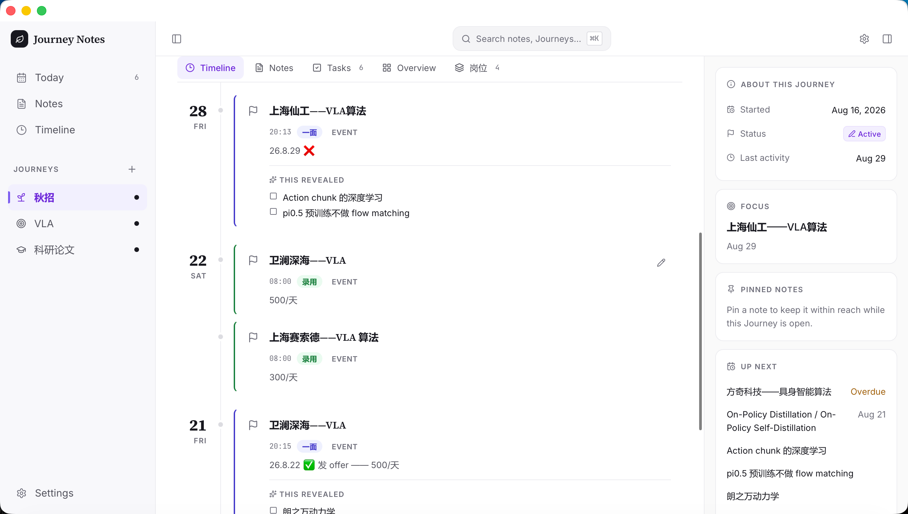
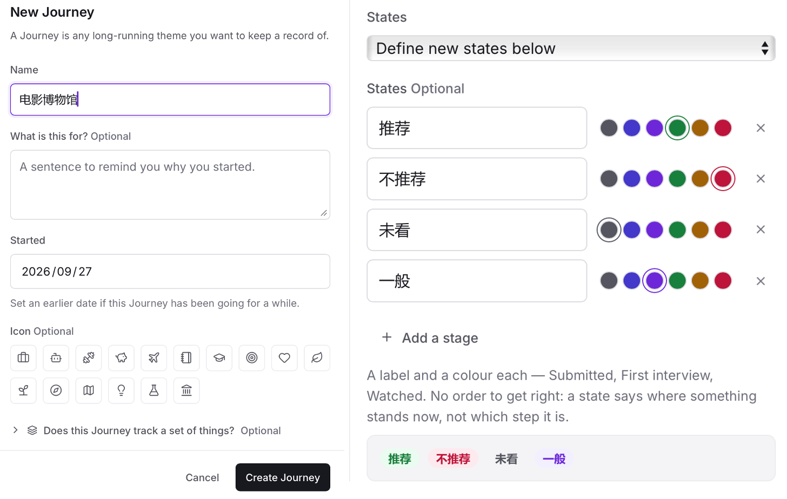
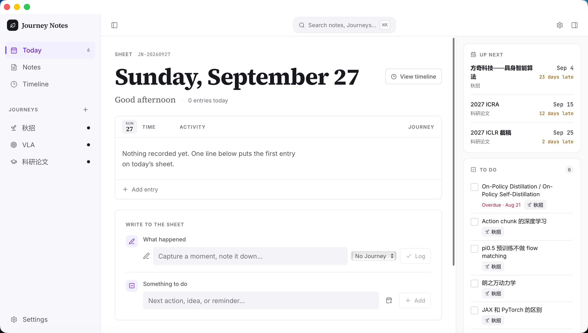

# 🧭 Jotrail

一款以时间线为核心的本地桌面笔记应用。把零散的笔记、待办和重要变化串成旅程，让你看见自己走过的路。

一次秋招、一个学习计划，或者一份观影清单，都可以是一段「旅程」。你可以随手记下一件事，也可以把相关记录放进同一个主题，慢慢积累出自己的时间线。

## 💡 我用它记录什么？

### 💼 秋招：记下进展，也找到下一步

最近我正在准备秋招，会用 Jotrail 记录各个岗位的面试进展，标记「一面」「录用」等状态，也把面试中发现的知识缺口记成待办。

回看一次面试，就能知道当时聊了什么、哪些地方还需要补充；下次打开时，也有一件明确的事可以接着做。



### 🎬 观影：建一座自己的电影博物馆

我也喜欢记录自己看过的电影。可以为它建一段「电影博物馆」旅程，自定义「未看」「推荐」「一般」「不推荐」等状态，再写下当时的观感。

同一段旅程也可以设置多个平等的状态类别：评分单选，类型多选，让一部电影同时属于「悬疑」和「爱情」，不分主次。类别和选项以后都能继续补充；删除已使用的选项时，需要先选好替代项。

记录事件时还可以附上海报或照片，时间线上会显示缩略图，点开就能放大查看，让每次观影多留下一点画面。

以后想找一部值得重看的电影，或回忆某次观影的感受，就有了自己的记录可翻。



### 🌿 日常：给普通的一天留一点记录

除了长期主题，我也会在这里记下每天的待办、生活里的小事，以及偶尔冒出的想法。几句话也值得留下，不必每次都写成长篇。

这些零散的片段会沿着时间积累。回头看时，就能想起那段日子在忙什么，又有哪些事情已经慢慢做成了。



## ✨ 基础功能

- 📝 Markdown 写作：用熟悉的 Markdown 写笔记，实时预览表格、代码块和数学公式
- 🗂️ 主题旅程：把同一主题下的笔记、事件和任务放在一起，按自己的方式组织记录
- 🏷️ 自定义分类：一个旅程可有多组单选或多选类别，按需填写，也能随时增补选项
- 🕰️ 时间线回顾：串联笔记、里程碑与状态变化，回看一件事如何慢慢发展
- 🖼️ 事件配图：添加或编辑事件时可选图片，支持缩略图、放大查看和后续增删
- ✅ 轻量任务：将待办关联到旅程，完成后留下时间线记录

## 🚀 快速开始

### 1) 环境准备

- Node.js 20.19+ 或 22.12+
- Rust 稳定版
- Tauri 2 所需的系统构建依赖：
  - macOS：Xcode Command Line Tools
  - Windows：MSVC 构建工具和 WebView2
  - Linux：WebKitGTK 及相关系统开发库

### 2) 安装依赖

```bash
npm ci
```

### 3) 启动桌面应用

```bash
npm run dev
```

### 4) 不加载示例数据启动（可选）

在 macOS/Linux 上运行：

```bash
npm run dev:clean
```

这个命令只关闭开发模式的示例数据加载，不会清空已有笔记。

## 📦 检查与打包

```bash
# 检查代码格式、ESLint、TypeScript 类型，并构建桌面前端
npm run check

# 打包桌面应用
npm run build
```

当前打包配置面向 macOS，会在以下目录生成 `.app` 应用：

```text
src-tauri/target/release/bundle/macos/
```

## 🔒 数据与隐私

笔记数据保存在操作系统的应用数据目录中，不在项目仓库内。
可以在「设置」中查看存储位置，并进行备份和导出。

- 笔记正文以 Markdown 文本存入本地 SQLite，事件图片也保存在数据库中，不依赖原文件路径。
- 完整备份包含文字和事件图片；导出包含 Markdown 笔记、JSON 结构化数据、SQLite 快照，以及 `images/` 中的事件原图。
- 每个事件最多 6 张图片，支持 PNG、JPEG 和静态 WebP，单张不超过 5 MB、2000 万像素。图片不会上传到云端。

笔记正文中自行引用的外部图片链接不属于事件附件，不会自动下载或收集。建议把备份或导出复制到其他磁盘，避免设备损坏时一并丢失。

## 🔗 交流社区

感谢 [LINUX DO 社区](https://linux.do/latest) 提供的交流空间，也欢迎分享你的使用体验与建议。
